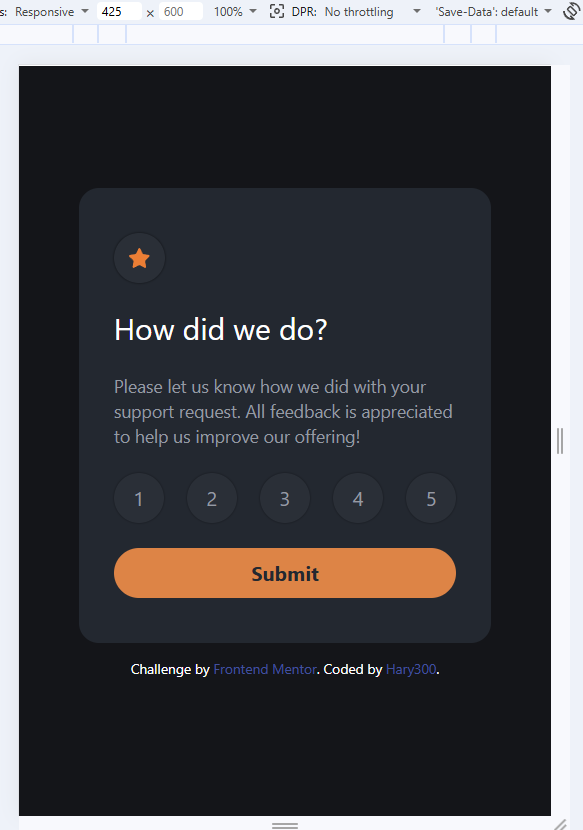
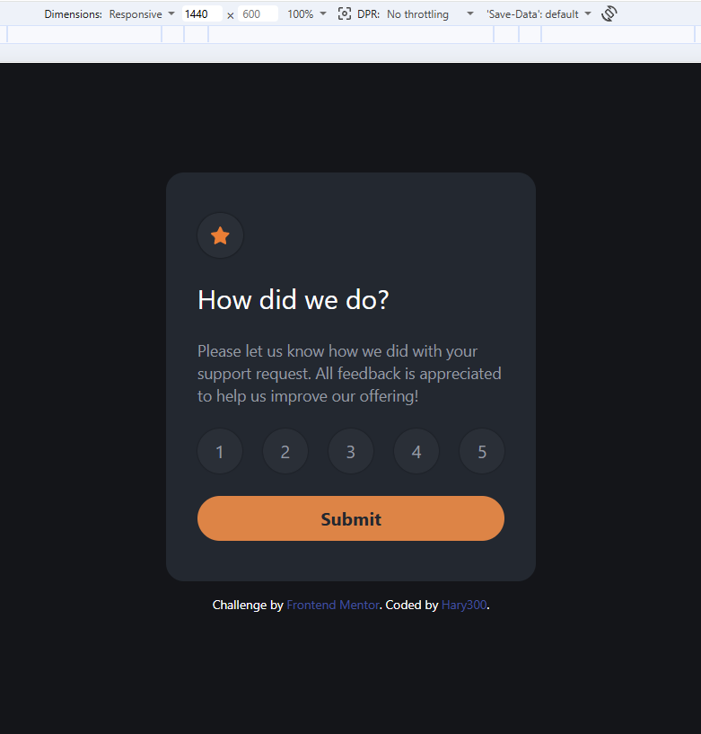

# Frontend Mentor - Interactive rating component


# Frontend Mentor - Interactive rating component solution

This is a solution to the [Interactive rating component challenge on Frontend Mentor](https://www.frontendmentor.io/challenges/interactive-rating-component-koxpeBUmI).

## Table of contents

- [Overview](#overview)
  - [The challenge](#the-challenge)
  - [Screenshot](#screenshot)
  - [Links](#links)
- [My process](#my-process)
  - [Built with](#built-with)
  - [What I learned](#what-i-learned)

## Overview

### The challenge

Users should be able to:

- View the optimal layout for the app depending on their device's screen size
- See hover states for all interactive elements on the page
- Select and submit a number rating
- See the "Thank you" card state after submitting a rating

### Screenshot




### Links

- Solution URL: (https://github.com/Hary300/Frontendmentor-Project-12-Interactive-Rating-Component)
- Live Site URL: (https://frontendmentor-project-12-interacti.vercel.app/)

## My process

### Built with

- Semantic HTML5 markup
- CSS custom properties
- Tailwind
- Flexbox
- CSS Grid
- Mobile-first workflow

**Note: These are just examples. Delete this note and replace the list above with your own choices**

### What I learned

1. ❌ Replacing DOM vs ✅ Appending Element
   ❌

```JS
// removes entire page
document.body.innerHTML = `<div>Modal</div>`;

✅
// keeps existing DOM
const modal = document.createElement('div');
document.body.append(modal);
```

👉 Problem:
Removes all elements and event listeners

👉 Solution:
Append new elements without breaking the structure

2. ❌ Unsynced State vs ✅ Synced State
   ❌

```js
btn.classList.remove('active');
// rateValue still exists

✅
btn.classList.remove('active');
rateValue = null;
```

👉 Problem:
UI and state become inconsistent

👉 Solution:
Always update both UI and state together

3. ❌ Static Query vs ✅ Dynamic Query
   ❌

```js
const rate = document.querySelectorAll('.rate');

✅
document.querySelectorAll('.rate').forEach(...);
```

👉 Problem:
Can become outdated when DOM changes

👉 Solution:
Query elements when needed

4. ❌ Multiple Event Binding vs ✅ Event Delegation
   ❌

```js
document.querySelectorAll('.rate').forEach(btn => {
  btn.addEventListener('click', ...)
});

✅
document.addEventListener('click', (e) => {
  const btn = e.target.closest('.rate');
  if (!btn) return;
});
```

👉 Problem:
Not scalable

👉 Solution:
Use a single event listener

🎯 Key Insight

❌ “As long as it works”
✅ “It should still work when things change”

# Front-end Style Guide

## Layout

The designs were created to the following widths:

- Mobile: 375px
- Desktop: 1440px

> 💡 These are just the design sizes. Ensure content is responsive and meets WCAG requirements by testing the full range of screen sizes from 320px to large screens.

## Colors

### Primary

- Orange 500: hsl(25, 97%, 53%)

### Neutral

- White: hsl(0, 100%, 100%)
- Grey 500: hsl(217, 12%, 63%)
- Grey 900: hsl(213, 19%, 18%)
- Grey 950: hsl(216, 12%, 8%)

## Typography

### Body Copy

- Font size (paragraph): 15px

### Font

- Family: [Overpass](https://fonts.google.com/specimen/Overpass)
- Weights: 400, 700
